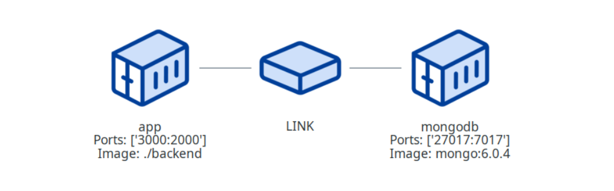

# DOCKER COMPOSE VISUALIZER

<br>
<br>
<br>

**Hello ;)**

This is VERY simple (and not perfect) script for create .png diagrams for `docker-compose.yml` files. You can use it for create documentation diagrams or validate docker compose yml structure (for instance: containers network connection).



<br>
<br>
<br>

## **Requirements:**

**1. python3**

**2. graphviz - example instalation for ubuntu**

```bash
sudo apt install graphviz
```

**3. diagrams (https://pypi.org/project/diagrams/)**

```bash
pip3 install diagrams
```

<br>
<br>
<br>

## **How to use**

**1. Clone this repo**

**2. Check requirements**

**3. Copy your `docker-compose.yml`**

> should be next to the main.py file

**4. Run script**

```py
python3 main.py
```

**5. Image will be save as `diagrams_image.png`**

<br>
<br>
<br>

## **Working example:**

### **Example 1**

**docker-compose.yml:**

```yml
version: "3.8"

services:
  mongodb:
    image: mongo:6.0.4
    container_name: todo-mongo
    restart: no
    env_file: ./.env
    networks:
      todo_network:
    environment:
      - MONGO_INITDB_ROOT_USERNAME=$MONGODB_USER
      - MONGO_INITDB_ROOT_PASSWORD=$MONGODB_PASSWORD
    ports:
      - 27017:7017
    volumes:
      - db:/data/db
      
  cache:
    container_name: todo-redis
    image: redis:6.2-alpine
    restart: no
    networks:
      todo_network:
    ports:
      - '6379:6379'
    command: redis-server --save 20 1 --loglevel warning
    volumes:
      - cache:/data
  app:
    depends_on:
      - mongodb
      - cache
    build: ./backend
    container_name: todo-node
    restart: no
    env_file: ./.env
    ports:
      - 3000:2000
    networks:
      todo_network:
    volumes:
      - type: bind
        source: .
        target: /backend
    environment:
      - DB_HOST=mongodb
      - DB_USER=$MONGODB_USER
      - DB_PASSWORD=$MONGODB_PASSWORD
      - DB_NAME=$MONGODB_DATABASE
      - DB_PORT=$MONGODB_DOCKER_PORT
      - REDIS_HOST=cache
      - REDIS_PORT=6379
    stdin_open: true
    tty: true
volumes:
  db:
  cache:

networks:
  todo_network:
```

**diagrams_image.png**


### **Example 2**

**docker-compose.yml:**

```yml
version: '3'
services:
  todo-backend:
    build: todo/backend
    container_name: todo-backend
    environment:
      - TZ=Europe/Warsaw
    restart: no
    volumes:
      - type: bind
        source: ./todo/backend
        target: /backend
    ports:
      - "8150:5000"
      - "51234:5678" 
    stdin_open: true
    networks:
      todo_network:
    tty: true

  todo-merger:
    build: merger
    container_name: todo-merger
    environment:
      - TZ=Europe/Warsaw
    restart: no
    volumes:
      - type: bind
        source: ./merger
        target: /merger
    ports:
      - "8151:5000"
      - "22222:5678" 
    stdin_open: true
    networks:
      todo_network:
    tty: true

  todo-wholesalers-mongodb:
    image: mongo:6.0.4
    container_name: todo-wholesalers-mongodb
    restart: no
    environment:
      - MONGO_INITDB_ROOT_USERNAME=root
      - MONGO_INITDB_ROOT_PASSWORD=123456
    ports:
      - "17017:27017"
    networks:
      todo_network:
    volumes:
      - db:/data/db
  
  todo-ariadne-mongodb:
    image: mongo:6.0.4
    container_name: todo-ariadne-mongodb
    restart: no
    environment:
      - MONGO_INITDB_ROOT_USERNAME=root
      - MONGO_INITDB_ROOT_PASSWORD=123456
    ports:
      - "17018:27017"
    networks:
      todo_network:
    volumes:
      - db2:/data/db
  
  todo-wholesalers-api:
    depends_on:
      - todo-wholesalers-mongodb
    build: wholesalers_api/app
    container_name: todo-wholesalers-api
    environment:
      - TZ=Europe/Warsaw
    restart: no
    volumes:
      - type: bind
        source: ./wholesalers_api/app
        target: /app
      - type: bind
        source: ./todo/backend
        target: /backend/db
    ports:
      - "8152:8000"
      - "33333:5678" 
    stdin_open: true
    networks:
      todo_network:
    tty: true
    
  todo-ariadne:
    depends_on:
      - todo-ariadne-mongodb
    build: todo-ariadne
    container_name: todo-ariadne
    environment:
      - TZ=Europe/Warsaw
    restart: no
    volumes:
      - type: bind
        source: ./todo-ariadne
        target: /todo-ariadne
    ports:
    networks:
      todo_network:
      - "8153:8000"
      - "44444:5678" 
    stdin_open: true
    tty: true    
    
volumes:
  db:
  db2:
  
networks:
  todo_network:
```

**diagrams_image.png**


### **Example 3**

**docker-compose.yml:**

```yml
version: "3.8"

services:
  mongodb:
    image: mongo:6.0.4
    container_name: todo-mongo
    restart: no
    env_file: ./.env
    environment:
      - MONGO_INITDB_ROOT_USERNAME=$MONGODB_USER
      - MONGO_INITDB_ROOT_PASSWORD=$MONGODB_PASSWORD
    ports:
      - 27017:7017
    volumes:
      - db:/data/db
  app:
    links:
      - mongodb
    build: ./backend
    container_name: todo-node
    restart: no
    env_file: ./.env
    ports:
      - 3000:2000
    volumes:
      - type: bind
        source: .
        target: /backend
    environment:
      - DB_HOST=mongodb
      - DB_USER=$MONGODB_USER
      - DB_PASSWORD=$MONGODB_PASSWORD
      - DB_NAME=$MONGODB_DATABASE
      - DB_PORT=$MONGODB_DOCKER_PORT
      - REDIS_HOST=cache
      - REDIS_PORT=6379
    stdin_open: true
    tty: true
volumes:
  db:
```

**diagrams_image.png**


### **if docker-compose.yml file not exist**


### **if docker-compose.yml is not valid**

